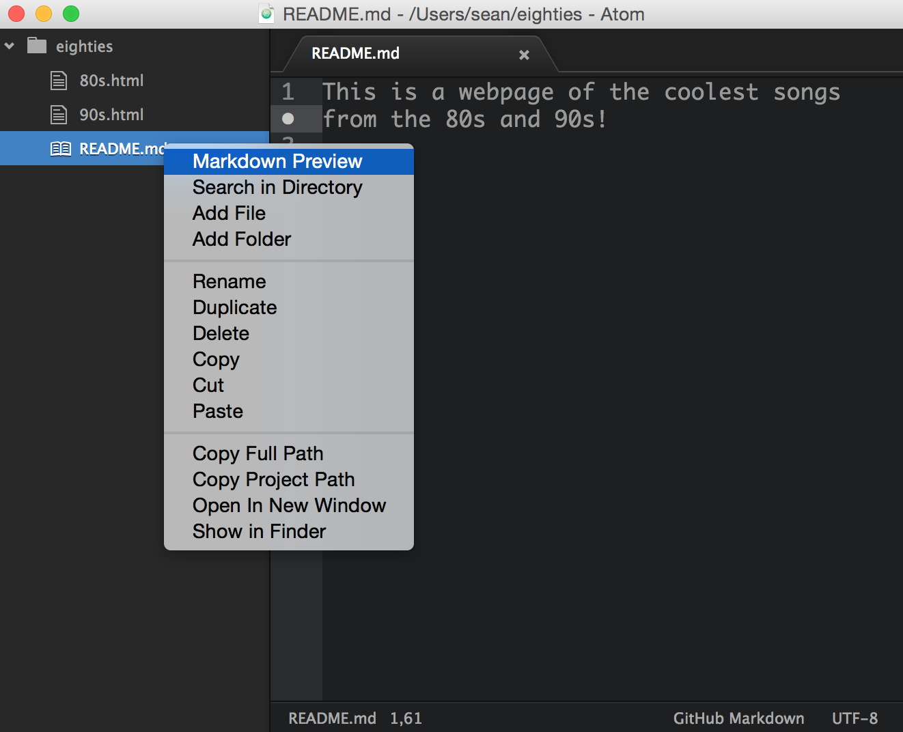
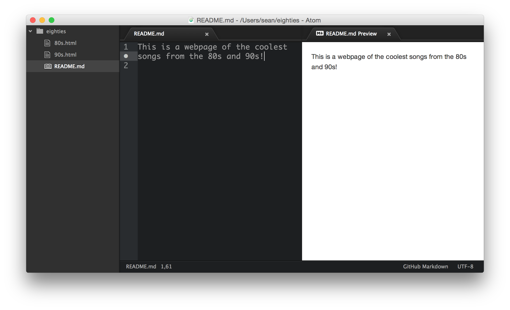
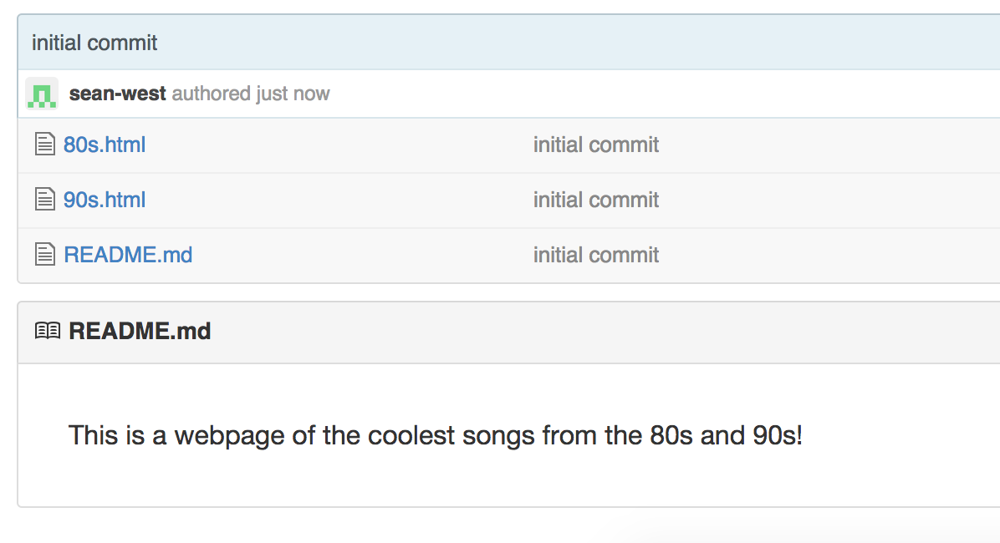

## Markdown and READMEs

Popular repos on Github often have a jazzy introduction to their project that shows right on their Github project's main page.

They accomplish this by including a ```Readme.md``` file in their repo written in a language called Markdown.

Check out some examples:
  - [browserify](https://github.com/substack/node-browserify)
  - [phaser](https://github.com/photonstorm/phaser)
  - [ponysay](https://github.com/erkin/ponysay)


### Adding a Readme to a repo

1. On your terminal, navigate to your ```eighties``` folder that you created earlier
2. Create a new file ```README.md```
3. Edit ```README.md``` in Atom and add a short description of the repo (e.g. "Here are some hits from the 80's and 90's")

### Previewing Markdown in Atom

1. In the Atom sidebar ctrl-click (or right-click) on ```README.md``` and select ```Markdown Preview``` 
2. You should see on the right hand side of Atom the rendered markdown 

### Pushing/Viewing on Github

1. Save all your changes to the git repo and push it up to Github
2. Now if you go to your project's page on Github, you should see the text that you put into the README showing below the list of files in the folder 

### Jazzing it up

That was kind of boring. Radio hits from the 80s and 90s had a lot going for them. We've got to add some spice to our Readme.

You probably don't yet know Markdown, so this will be one of your first assignments in digging into documentation.

#### Use these resources as your guides to Markdown:
  - [Markdown Basics](https://help.github.com/articles/markdown-basics/)
  - [Mastering Markdown](https://guides.github.com/features/mastering-markdown/)
  - [Markdown Cheatsheet](https://github.com/adam-p/markdown-here/wiki/Markdown-Cheatsheet)

#### Enhance your README.md
1. Create a header of some sort (a title with big font)
2. Create a list in markdown for the names of the artist/bands included in the html files in that folder. There should be one list for the 80s and one for the 90s
3. Include in your Readme at least 3 images of the artists or bands. In markdown you can add an image simply by using an Image URL (a link to the image, like http://sfcitizen.com/blog/wp-content/uploads/2012/02/vintage-Vanilla-Ice-copy.jpg)
4. Include at least 3 urls to what may be the artist's or band's current official webpage (e.g. [Vanilla Ice?](http://www.vanillaice.com/vanillaice.html))
5. Add a GIF of one of the artists/bands for good measure
